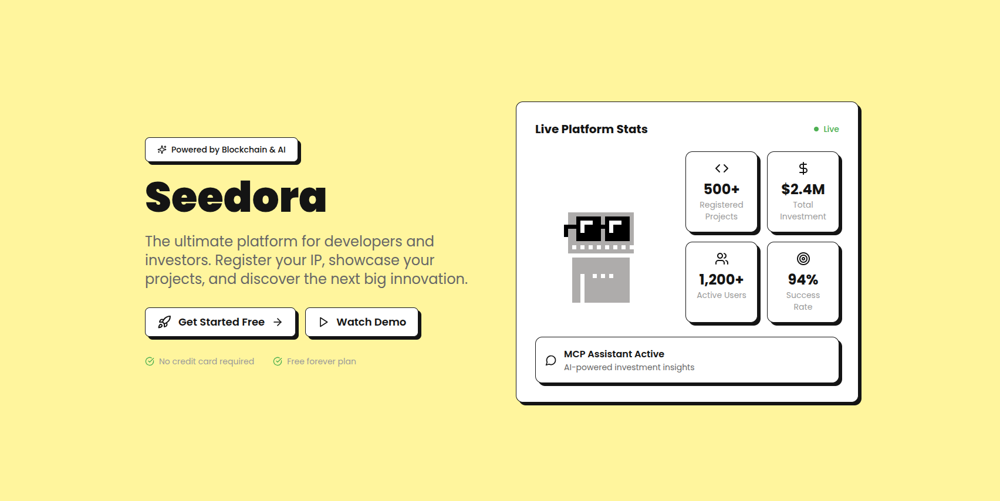
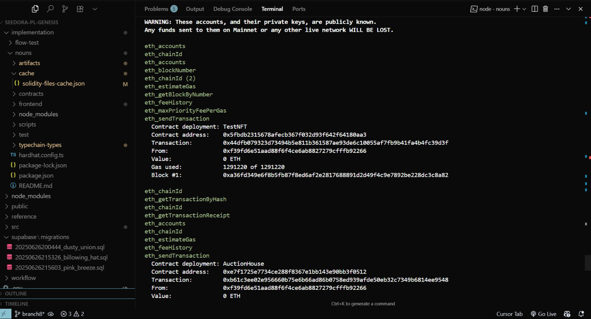
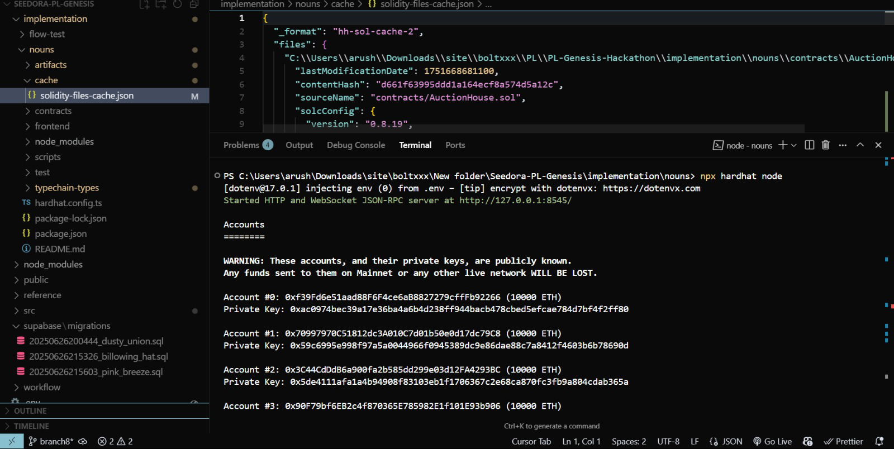

<div align="center">

# Seedora

**An Accelerator that helps developers get initial funding.**

Seedora is a next-generation platform that empowers developers to protect their intellectual property, showcase their projects, and connect with investors for early-stage funding. By combining blockchain-based IP registration, AI-powered analytics, and seamless GitHub integration, Seedora bridges the gap between innovation and investment.



</div>

---

## Project Structure

```text
Seedora-PL-Genesis/
├── src/
│   ├── components/      # React UI components (LandingPage, UserProfile, IPRegistration, AuctionSystem, etc.)
│   ├── contexts/        # React context providers (Auth, etc.)
│   ├── lib/             # Integrations (supabase, filcdn, etc.)
│   ├── services/        # Blockchain and backend service logic
│   ├── data/            # Demo and seed data
│   ├── constants/       # App-wide constants
│   ├── config/          # App configuration (wagmi, etc.)
│   └── types/           # TypeScript type definitions
├── implementation/
│   ├── flow-test/       # Flow blockchain contracts, scripts, and transactions (Cadence)
│   └── nouns/           # Ethereum smart contracts (Nouns-style auction), frontend, and tests
├── public/              # Static assets and landing page
├── reference/           # Reference implementation and docs
├── workflow/            # Workflow and migration scripts
├── supabase/            # Supabase migrations and SQL
├── package.json         # Project dependencies and scripts
└── README.md            # Project documentation (this file)
```

---

## Key Features

- **IP Protection:** Register your projects as intellectual property on the blockchain for permanent, tamper-proof protection (Flow).
- **GitHub Integration:** Connect your GitHub repositories to showcase your technical expertise and code quality.
- **Investment Opportunities:** Discover and invest in innovative projects from talented developers worldwide.
- **AI-Powered Analytics:** Leverage Machine Callable Programs (MCP) for smart investment decisions and project insights.
- **Decentralized Storage:** Store project files and videos on Filecoin via FilCDN for secure, censorship-resistant hosting.
- **Nouns-Style Auctions:** Run Ethereum-based NFT auctions for project fundraising and community engagement.
- **Dashboards:** Tailored experiences for both developers and investors, including project management, analytics, and investment tracking.

---

## Tech Stack

<div align="center">

| Frontend      | Backend/DB      | Blockchain         | Storage         | AI/Analytics | Integrations           |
|---------------|-----------------|--------------------|-----------------|--------------|------------------------|
| React         | Supabase        | Flow (Cadence)     | Filecoin/FilCDN | MCP          | GitHub API             |
| TypeScript    | Postgres/Auth   | Ethereum (Solidity)|                 |              | WalletConnect, RainbowKit |
| Vite          | Storage         |                    |                 |              | Ethers.js              |
| TailwindCSS   |                 |                    |                 |              |                        |
| Lucide Icons  |                 |                    |                 |              |                        |

</div>

---

## Architecture Overview

- **Monorepo** with modular structure for core app, smart contracts, and reference implementations.
- **Smart Contracts:**
  - `implementation/flow-test/cadence/contracts` (Flow, Cadence)
  - `implementation/nouns/contracts` (Ethereum, Solidity)
- **Supabase** for authentication, user/project data, and storage.
- **FilCDN** for decentralized file/video storage and streaming.
- **React Context** for authentication and global state.
- **Service Layer** for blockchain and storage integrations.

---

## Protocols & Integrations

### FLOW
- **Use:** Blockchain platform for registering and timestamping intellectual property (IP) on-chain.
- **Implementation:** Cadence smart contracts and scripts for creating immutable records of project IP, providing proof of ownership and registration dates. Interactions are handled via the Flow JS SDK.

### NOUNS
- **Use:** Ethereum-based auction system for NFTs, inspired by the Nouns DAO model.
- **Implementation:** Solidity smart contracts (`AuctionHouse.sol`, `TestNFT.sol`) manage NFT minting and time-based auctions. Used for project tokenization, fundraising, and community engagement.

### FILECOIN & FILCDN
- **Use:** Decentralized storage network (Filecoin) and CDN layer (FilCDN) for secure, persistent storage and fast delivery of project files, videos, and documentation.
- **Implementation:** Project assets are uploaded to Filecoin via the FilCDN integration, ensuring censorship resistance and long-term availability.

### SUPABASE
- **Use:** Backend-as-a-Service for authentication, database, and file storage.
- **Implementation:** Stores all project metadata, images, and user data (except for titles, which are on-chain).

### GITHUB
- **Use:** OAuth authentication and repository integration.
- **Implementation:** Users can link their GitHub accounts, display repositories, and connect code to registered projects.

### MCP (Machine Callable Programs)
- **Use:** AI-powered analytics and investment insights.
- **Implementation:** Provides smart recommendations, risk assessments, and investment signals to both developers and investors.

---

## AI Escrow System

Seedora features an innovative AI-powered escrow system that automates milestone-based payments, builds trust between developers and investors, and ensures transparent project delivery.

**Path:**
- Solidity/Ethereum implementation: `src/components/EscrowComponent.tsx`, `src/constants/escrow.ts`, and related smart contract logic in `implementation/nouns/contracts/`
- Service logic: `src/services/`

### Key Features
- **Milestone-Based Funding:** Investments are held in escrow and released as developers complete predefined milestones.
- **AI-Powered Verification:** Machine Callable Programs (MCP) analyze code commits, project updates, and deliverables (via GitHub and Supabase integration).
- **Automated & Transparent:** Real-time escrow status and milestone progress are visible in the Seedora dashboard. All actions are recorded on-chain and in Supabase.
- **Dispute Resolution:** AI provides initial assessments for disputes, with escalation to community/admin if needed.
- **Audit Trail:** Every action is logged for transparency and accountability.

### Example Workflow
```text
Investor funds a project → Funds locked in escrow smart contract.
Developer completes milestone → AI verifies via code analysis and project data.
If approved, funds for that milestone are released automatically.
If not, AI flags for review and both parties are notified.
```

### Integration Tracks
- **Frontend:** `src/components/EscrowComponent.tsx` (UI for escrow status, milestone progress, and actions)
- **Backend/Smart Contracts:** `implementation/nouns/contracts/` (Solidity escrow logic)
- **Constants/Config:** `src/constants/escrow.ts` (escrow contract addresses and config)
- **Service Layer:** `src/services/` (blockchain and AI/MCP integration)
- **Supabase:** Used for storing off-chain metadata, milestone details, and audit logs
- **AI/MCP:** Automated milestone verification and dispute flagging

This system ensures trustless, milestone-based payments and leverages AI for unbiased, automated project delivery verification.

---

## Smart Contracts

### Flow (Cadence)
- **Location:** `implementation/flow-test/cadence/contracts`
- **Purpose:** IP registration, project management, and on-chain title storage.

### Ethereum (Solidity, Nouns Auction)
- **Location:** `implementation/nouns/contracts`
- **TestNFT Contract** (Deployed at `0x5FbDB2315678afecb367f032d93F642f64180aa3`)
  - Basic NFT implementation for testing
  - Supports minting and approval operations
- **AuctionHouse Contract** (Deployed at `0xe7f1725E7734CE288F8367e1Bb143E90bb3F0512`)
  - Handles NFT auctions in Nouns style
  - Features:
    - Create auctions with reserve prices
    - Place bids with ETH
    - Automatic auction settlement
    - Time-based auction mechanics

---

## Screenshots

<div align="center">

### Nouns Auction Contract Deployment (Ethereum)

<p style="color: #6b7280; font-size: 1rem; margin-top: 0.5em;">
Terminal output showing <b>successful deployment</b> of the <b>TestNFT</b> and <b>AuctionHouse</b> contracts on a local Ethereum (Hardhat) network, including contract addresses and transaction details.
</p>

---

### Flow Contract Deployment

<p style="color: #6b7280; font-size: 1rem; margin-top: 0.5em;">
Visual Studio Code with Cadence contract code and terminal output showing <b>successful deployment</b> of multiple contracts (including <b>IPRegistration</b>) to the Flow emulator, confirming all contracts deployed successfully.
</p>

</div>

---

## Local Development

### Prerequisites

- Node.js (v18+ recommended)
- npm or yarn
- Git

### Setup

1. **Clone the repo:**
   ```bash
   git clone https://github.com/Prthmsh7/Seedora-PL-Genesis.git
   cd Seedora-PL-Genesis
   ```
2. **Install dependencies:**
   ```bash
   npm install
   # or
   yarn install
   ```
3. **Configure environment variables:**
   - Copy `.env.example` to `.env` and fill in:
     - `VITE_SUPABASE_URL`
     - `VITE_SUPABASE_ANON_KEY`
     - (Optional) FilCDN, Flow, and other API keys as needed
4. **Run the app:**
   ```bash
   npm run dev
   # or
   yarn dev
   ```
5. **Build for production:**
   ```bash
   npm run build
   # or
   yarn build
   ```

---

## Further Documentation

- See the `reference/` and `workflow/` directories for migration guides, SQL, and advanced setup.
- Smart contract details and deployment scripts are in `implementation/flow-test` and `implementation/nouns`.

---

## Acknowledgments

- Nouns DAO for auction inspiration
- Supabase, Filecoin, Flow, and GitHub for their open platforms
- All contributors and testers

---

<div align="center">
  <p>Built with soo muchhh ❤️ by the Seedora team</p>
  <p>
    <a href="seedora-ruddy.vercel.app">Website</a> •
    <a href="https://www.youtube.com/watch?v=4gktXXOVRQI">Demo</a> •
    <a href="https://github.com/Arrrzushi/seedora">GitHub</a> 
  </p>
</div>
